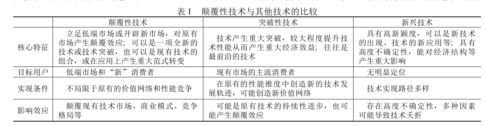

# 颠覆性技术（Disruptive Technologies）

对于颠覆性技术的一些资料收集与总结

# 目录

1. [介绍](#介绍)
2. [相关方法](#相关方法)
3. [资源](#资源)   
   - [code](#code)
   - [论文](#论文)

# 介绍

[百度百科介绍](https://baike.baidu.com/item/%E9%A2%A0%E8%A6%86%E6%80%A7%E6%8A%80%E6%9C%AF/50894935?fr=aladdin)

立足低端市场或开辟新市场，对原有 市场产生颠覆效应; 可以是一项全新的技术或技术突破，也可以是现有技术的 组合，或在应用上产生重大范式转变。

### 颠覆性技术两种视角

1. 技术视角：关注的是颠覆性技术的性能质量和成本，认为颠覆性技术具备一定的 技术性能和较低的成本。
2. 市场视角：关注的是颠覆性技术的市场特征，认为颠覆性技术改变了市场的绩效指标或消费者期望。

### 颠覆性技术的特点

1. 发展过程复杂
2. 高度不确定性

### 颠覆性技术的定义

1. 颠覆性技术通过引入新的技术属性而使得原有技术发生了轨道跃迁，存在着技术 上的不连续性;
2. 开始时面向特定或细分市场，随着技术性能的不断提升，逐渐满足主流用户的需求并向主流市场扩散;
3. 颠覆性技术的发展能够引起技术性能标准和行业技术基础的变化，改变市场规则从而引起竞争范式的转变

### 作用

开展颠覆性技术的识别和判断研究，有助于把握相关领域的技术发展方向和趋势，从国家层面加强对产业发展战略 布局的规划和指导。

# 相关方法

#### 基于专家评议

1. 技术路线图：运用图形、文字、表格等描绘技术的 发展和变化趋势，是一种灵活的技术规划管理和识 别颠覆性技术的有效工具，但需要全面而完整的技术数据，但颠覆性技术的历史数据较少，往往做不到对技术的查全查准
2. 德尔菲法：以专家意见为基础的反馈匿名函询法，通过多轮征询，使得意见趋于一致，但需要耗费大量的人力物力，一定程度上很依赖于专家的个人经验。
3. 情景分析法：据技术的发展给出基于未来条件的若干种情景，是 一种定量和定性分析相结合的方法，在初始阶段征集专家意见，后期进行定量分析。

#### 基于技术演化

1. 模型分析法：用数学统计方法来构建量化模型并对颠覆性技术进行评价，主要有 TRIZ理论、DEA（数据包络分析法）、AHP( 层次分析法)

#### 基于指标模型

1. 评估指标法：根据颠覆性技术的特征，通过建立多种指标的评价机制来识别颠覆性技术并结合一定的技术实例对其进行验证。
2. 定量识别法：通过建立数学模型与多指标评估框架对技术进行大范围评估，被广泛应用于评估颠覆性技术的影响与市场价值。但该方法是对颠覆性技术产生作用后进行的事后评价，缺乏对生命周期初期技术的颠覆性进行判断。

#### 基于文献关系

1. 文献计量法：对专利、论文、文献数据进行处理和计算，采用路径分析、文献知识 联、共词聚类分析、网络分析等方法实现对颠覆性技术的识别和预测。

# 资源

## code

1. [CDindex](https://github.com/russellfunk/cdindex) 利用引文之间的信息，给每一个节点一个CDindex值。
2. [Leiden 聚类算法](https://github.com/vtraag/leidenalg_)根据引文信息进行聚类的算法。

## 论文

1. [曹艺文,许海云,武华维,罗瑞.基于引文曲线拟合的新兴技术主题的突破性预测——以干细胞领域为例[J].图书情报工作,2020](https://kns.cnki.net/kcms/detail/detail.aspx?dbcode=CJFD&dbname=CJFDLAST2020&filename=TSQB202005015&uniplatform=NZKPT&v=ijZ9ZmCNlIqYahgDn5id4EBQc5Fjxu9QpBbhyuvi9BKk9WvlRATz0palKRjS-OkA)
2. [白光祖,郑玉荣,吴新年,靳军宝,刘秋艳.基于文献知识关联的颠覆性技术预见方法研究与实证[J].情报杂志,2017](https://kns.cnki.net/kcms/detail/detail.aspx?dbcode=CJFD&dbname=CJFDLAST2017&filename=QBZZ201709007&uniplatform=NZKPT&v=RsuyfKITwEAHh9pzcOqxU_DDwKC6gS-JIlEIaMWXRLQyxeFTHVGknqZLTgQLe6eg)
3. [石慧,潘云涛,苏成.颠覆性技术及其识别预测方法研究综述[J].情报工程,2019](https://kns.cnki.net/kcms/detail/detail.aspx?dbcode=CJFD&dbname=CJFDLAST2019&filename=QBGC201903005&uniplatform=NZKPT&v=JzPDcOsrZ8yg-n2WXnr8sRIFNc-MgwH00KwLX8oOGKrhNyHStaJMb4jWj9eAXqEW)
4. [张佳维,董瑜.颠覆性技术识别指标的研究进展[J].情报理论与实践,2020](https://kns.cnki.net/kcms/detail/detail.aspx?dbcode=CJFD&dbname=CJFDLAST2020&filename=QBLL202006029&uniplatform=NZKPT&v=dsPu6H2oTgpD_8CEHtbb9FonIqtzQkMF0phxULhTA3RYGuuiia6-FAeZJtLZAl-7)
5. [开庆,窦永香.颠覆性技术识别研究综述[J].情报杂志,2021](https://kns.cnki.net/kcms/detail/detail.aspx?dbcode=CJFD&dbname=CJFDAUTO&filename=QBZZ202111005&uniplatform=NZKPT&v=fDjsTQ_pkUdOp19bAbGGQP84XxY8_v6EXGTAz1R6xXEAUEVqGIZYigO9ac7BJ9sE)
6. [黄鲁成,成雨,吴菲菲,苗红,李欣.关于颠覆性技术识别框架的探索[J].科学学研究,2015](https://kns.cnki.net/kcms/detail/detail.aspx?dbcode=CJFD&dbname=CJFDLAST2015&filename=KXYJ201505003&uniplatform=NZKPT&v=YMg5c5SRgbfK_3Gl7P3xfukCLQC72vpqTYT_f2EksBj2LqHErmCKPRl-TiDGHrMZ)
7. [刘云,桂秉修,王小黎.基于引文网络的颠覆性技术发展路径研究[J/OL].科研管理:1-26[2021-12-08]](https://kns.cnki.net/kcms/detail/detail.aspx?dbcode=CAPJ&dbname=CAPJLAST&filename=KYGL20211022001&uniplatform=NZKPT&v=AOcUFPWciSq5IqOe1Z7u6uoyrkTF4oy7OtKbys-Wmjw3Wsc1ZCPXd44-oOGuXZWD)
8. [张立国,黄世亮,焦剑,赵瑾.国防生物领域颠覆性技术动态识别框架构建研究[J].解放军预防医学杂志,2020](https://kns.cnki.net/kcms/detail/detail.aspx?dbcode=CJFD&dbname=CJFDLAST2021&filename=JYYX202010002&uniplatform=NZKPT&v=pjtlOWWGPjH9MFadGeOOB0uENoyyKx7bQdAIw7sBhNd750gq16V_36ljbGxk_b_i)
9. [侯广辉,廖桂铭,王刚.基于突变级数的颠覆性技术识别模型构建及实证研究[J].情报杂志,2021](https://kns.cnki.net/kcms/detail/detail.aspx?dbcode=CJFD&dbname=CJFDAUTO&filename=QBZZ202110002&uniplatform=NZKPT&v=fDjsTQ_pkUe3fl2Q1bKhR3ChW8oyGW_YuP6xG2Ca7N2KZZFTVaaVNjwgzUYWZa64)
10. [于光辉,宁钟,李昊夫.基于专利和Bass模型的颠覆性技术识别方法研究[J].科学学研究,2021](https://kns.cnki.net/kcms/detail/detail.aspx?dbcode=CJFD&dbname=CJFDLAST2021&filename=KXYJ202108013&uniplatform=NZKPT&v=i1X6FvyipJ9VRyqN-WOTrN72ZRvKNKddv4n9GkZEygpSjv3on6Az8UcKBwP52rNt)

# 其他

[返回顶层](#目录)

